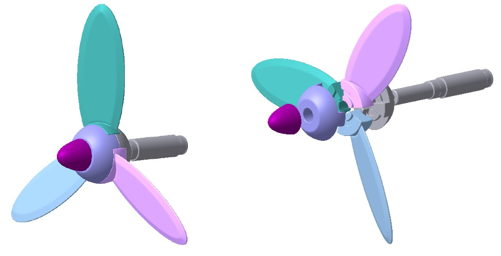
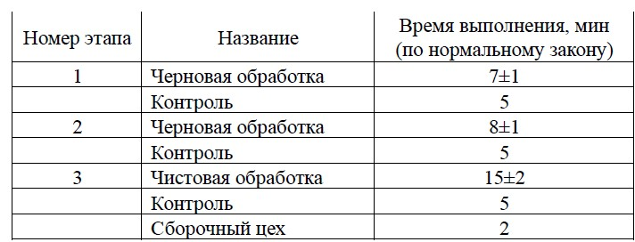
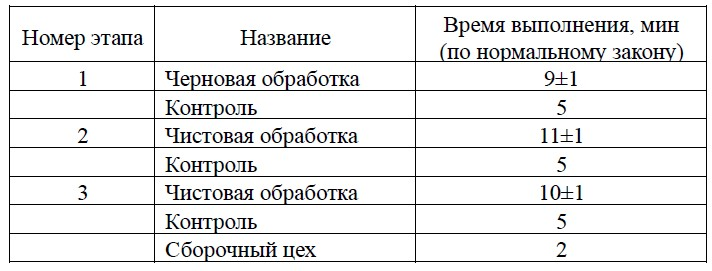

# AnyLogicProjects
## Моделирование производственного участка в AnyLogic.

### Условие
Производственная ячейка по сборке гребных винтов состоит из следующих цехов: 
* Заготовительный цех, производящий заготовки двух типов:
    * Валы (всего 25 шт., каждые 7±2 минуты по нормальному закону);
    * Корпуса (всего 50 шт., каждые 3±1 минуты по нормальному закону). 
* Цех черновой обработки, в который входят 3 станка.
* Цех чистовой обработки, в который также входят 3 станка.
* Контрольный цех, в котором в течение 5 минут детали контролируются. Контроль выполняется после каждой операции, исключая сборку. Используется одно рабочее место. Вероятность брака – 6%. Брак считается невосстановимым, деталь отправляется в выходной склад. Если брака нет, и обработка детали закончена, то она отправляются на сборку. Если нет, то в цех обработки на следующую операцию.
* Сборочный цех, в котором собираются гребные винты из 3-х деталей: одного вала и двух корпусов. Сборка длится 2 минуты, используется одно рабочее место. После сборки гребной винт отправляется на выходной склад, минуя операцию контроля.

### Дополнительные условия
* Транспортировка из цеха в цех занимает 5 минут.
* Последовательность обработки вала:

* Последовательность обработки корпуса:

### Требуется
* Смоделировать изготовление 15 гребных винтов.
* Собрать статистику о количестве бракованных деталей. 
* Собрать статистику о загрузке оборудования системы.

### Мануал

1. Скачиваете модель PropellerPlant.alp и excel файл DB.xlsx
2. Заполняете базу данных (DB.xlsx). (В таблице Procurement_shop в детерменированном законе указывайте, например, 5 минут + 0.00001 для избежания временных конфликтов)
3. При запуске модели выставляете параметры и запускаете

[Ссылка на видеопрезентацию модели](https://youtu.be/aeBxA_I0xgA)
